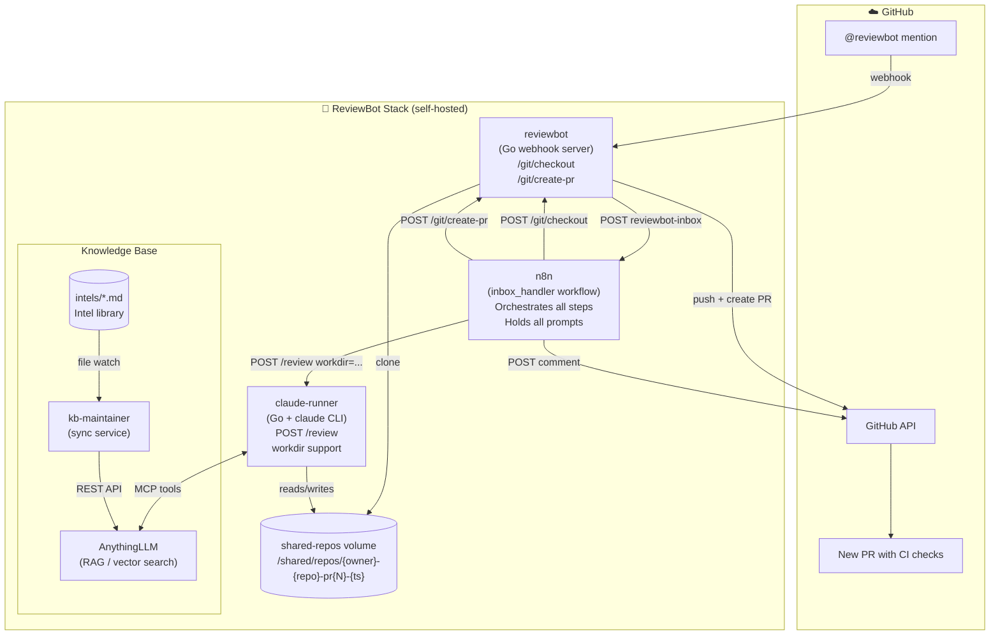

# ReviewBot — Architecture

> **Status**: Active development · February 2026
> **Goal**: Automatically analyse any GitHub repository for security vulnerabilities, generate lightweight CI checks, and open a Pull Request with those checks.

---

## Zones of Responsibility

| Service | Role | Tech |
|---------|------|------|
| **reviewbot** | GitHub App: receives webhooks, authenticates as App, exposes git operations (`/git/checkout`, `/git/create-pr`) for n8n to call | Go |
| **claude-runner** | AI code agent: runs `claude` CLI with a given prompt in a given directory, returns output | Go + Claude CLI |
| **n8n** | Orchestrator: defines the pipeline steps, prompts, and control flow in a no-code/low-code environment | n8n (self-hosted) |
| **anythingllm** | Knowledge Base (KB): stores intel files and per-repo analysis; queried by claude via MCP | AnythingLLM (self-hosted) |
| **kb-maintainer** | Keeps `./intels/*.md` files synced into AnythingLLM workspace | Go |

---

## System Overview

```
GitHub
  │  webhook (PR comment mentioning @reviewbot)
  ▼
reviewbot (Go)
  │  POST /webhook/reviewbot-inbox → n8n
  ▼
n8n — inbox_handler workflow
  │
  ├─ POST reviewbot /git/checkout        → clones repo to shared volume, creates branch
  │
  ├─ POST claude-runner /review          → "understand this repo" prompt
  │       (reads/writes AnythingLLM KB via MCP)
  │
  ├─ POST claude-runner /review          → "find 2-3 CI checks" prompt
  │
  ├─ [loop per check]
  │   └─ POST claude-runner /review      → "implement {check}, commit it" prompt
  │
  └─ POST reviewbot /git/create-pr       → pushes branch, opens GitHub PR
          │
          └─ POST GitHub API             → posts PR link to original comment
```

---

## inbox_handler Pipeline

Triggered when someone comments `@reviewbot` on a GitHub PR or issue.

| Step | Action | Notes |
|------|--------|-------|
| 1 | **Checkout** | Fresh isolated clone per review run (`/shared/repos/{owner}-{repo}-pr{N}-{ts}`), new branch `reviewbot-pr{N}-{ts}` |
| 2 | **Sanitize** | No-op; future: malicious file scan, rate limiting |
| 3 | **Acknowledge** | Immediate GitHub comment: "I'm on it" |
| 4 | **General Understanding** | claude analyzes repo, checks KB for prior analysis, stores findings in AnythingLLM |
| 5 | **Find CI Checks** | claude identifies 2-3 high-value checks not already present |
| 6 | **Implement Checks** (loop) | claude implements each check, commits with "Why:" message |
| 7 | **Create PR** | reviewbot pushes branch and opens GitHub PR |
| 8 | **Notify** | GitHub comment with link to the new PR |

---

## Shared Volume

Both `reviewbot` and `claude-runner` mount a Docker volume at `/shared`.

- reviewbot's `POST /git/checkout` creates `/shared/repos/{owner}-{repo}-pr{N}-{ts}/`
- n8n receives the path and passes it to subsequent `claude-runner` calls as `workdir`
- claude-runner skips cloning when `workdir` is set; commits land in the shared volume
- reviewbot's `POST /git/create-pr` pushes from that directory

```
reviewbot container          claude-runner container
  /shared/repos/               /shared/repos/
    owner-repo-pr42-ts/          owner-repo-pr42-ts/  ← same physical volume
      .github/workflows/           .github/workflows/
      ...                          ...
```

---

## AnythingLLM as Knowledge Base

Two types of knowledge stored in AnythingLLM:

| Type | Workspace | Content |
|------|-----------|---------|
| **Intel library** | `intels` | Security vulnerability patterns, best practices (in `./intels/*.md`) |
| **Repo analysis** | `intels` (same, different docs) | Per-repo understanding docs: `{repo}-{ts}-understanding` |

claude-runner has the `anythingllm-mcp-server` configured in `~/.claude.json`.
Prompts instruct claude to:
1. Search KB for existing repo analysis (to avoid re-doing work)
2. Search KB for relevant intel (to guide the review)
3. Store new findings after analysis

---

## Reviewbot API Endpoints

| Endpoint | Description |
|----------|-------------|
| `POST /webhook` | GitHub webhook receiver (validates HMAC, routes events) |
| `GET /callback` | OAuth callback (GitHub App installation flow) |
| `GET /health` | Health check |
| `POST /git/checkout` | Clones repo to shared volume, creates review branch |
| `POST /git/create-pr` | Pushes review branch and opens a GitHub Pull Request |

### `POST /git/checkout`

```json
// Request
{ "owner": "...", "repo": "...", "github_token": "ghs_...", "pr_number": 42 }

// Response
{ "repo_path": "/shared/repos/owner-repo-pr42-20260222T153000Z", "branch": "reviewbot-pr42-20260222T153000Z", "default_branch": "main" }
```

### `POST /git/create-pr`

```json
// Request
{ "repo_path": "/shared/repos/...", "owner": "...", "repo": "...", "github_token": "ghs_...", "branch": "reviewbot-pr42-...", "base": "main", "title": "...", "body": "..." }

// Response
{ "pr_url": "https://github.com/owner/repo/pull/43", "pr_number": 43 }
```

---

## Claude-Runner API

### `POST /review`

```json
// Request — with workdir (pre-cloned repo)
{
  "owner": "...", "repo": "...", "pr_number": 42,
  "workdir": "/shared/repos/owner-repo-pr42-20260222T153000Z",
  "prompt": "..."
}

// Request — without workdir (fresh clone)
{
  "owner": "...", "repo": "...", "pr_number": 42,
  "github_token": "ghs_...",
  "prompt": "..."
}

// Response
{ "review": "...claude output as markdown..." }
```

When `workdir` is set, the directory is NOT deleted after the run (lifecycle managed by the pipeline).

---

## Key Design Principles

1. **Separation of concerns** — reviewbot handles GitHub auth and git ops; claude-runner handles AI; n8n handles orchestration logic and prompts
2. **Prompts live in n8n** — changing a prompt doesn't require redeploying code; update the n8n workflow
3. **KB-first** — before any analysis, claude checks AnythingLLM for prior work to avoid redundant effort
4. **Explainability** — every generated CI check has a commit message with a "Why:" explanation
5. **Cheap at runtime** — expensive AI pipeline runs once; generated checks run on every commit for free
6. **LLM-agnostic** — claude-runner pattern can be replicated for gemini-runner with the same API shape

---

## Repository Layout

```
reviewbot/
├── main.go                          — HTTP server, endpoint registration
├── internal/
│   ├── config/config.go             — env-var config (incl. SharedReposDir)
│   ├── github/
│   │   ├── client.go                — GitHub App client factory
│   │   └── webhook.go               — webhook validation + event routing
│   ├── handler/
│   │   ├── handler.go               — ClientFactory / TransportFactory interfaces
│   │   ├── comment.go               — @reviewbot mention → dispatch to n8n
│   │   ├── pullrequest.go           — PR opened (no-op; pipeline triggered by mention only)
│   │   ├── ping.go                  — GitHub ping event handler
│   │   └── github_ops.go            — /git/checkout and /git/create-pr handlers
│   ├── git/git.go                   — low-level git helpers (clone, branch, push, commit)
│   ├── middleware/logging.go        — request logging middleware
│   └── oauth/oauth.go               — OAuth callback for app installation
│
├── services/
│   ├── claude-runner/               — AI agent runner (Go + claude CLI)
│   │   ├── main.go                  — POST /review handler (supports workdir)
│   │   └── Dockerfile
│   └── kb-maintainer/               — AnythingLLM sync service (Go)
│
├── n8n/
│   └── schemas/
│       ├── inbox_handler.json       — MAIN: full security review pipeline
│       ├── claude-runner-test.json  — Dev tool: test claude-runner directly
│       └── poc-review-pipeline.json — Legacy POC (superseded)
│
├── intels/                          — Intel markdown files (synced to AnythingLLM)
├── docs/                            — Additional documentation
└── docker-compose.yml               — Full stack definition
```

---

## Mermaid Diagram


