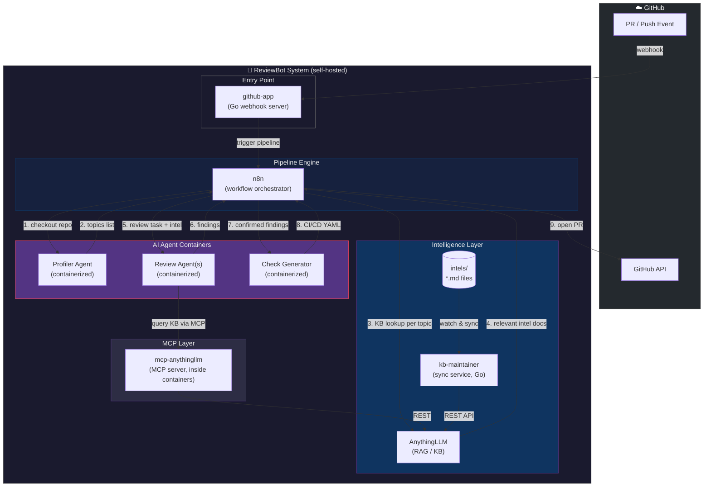
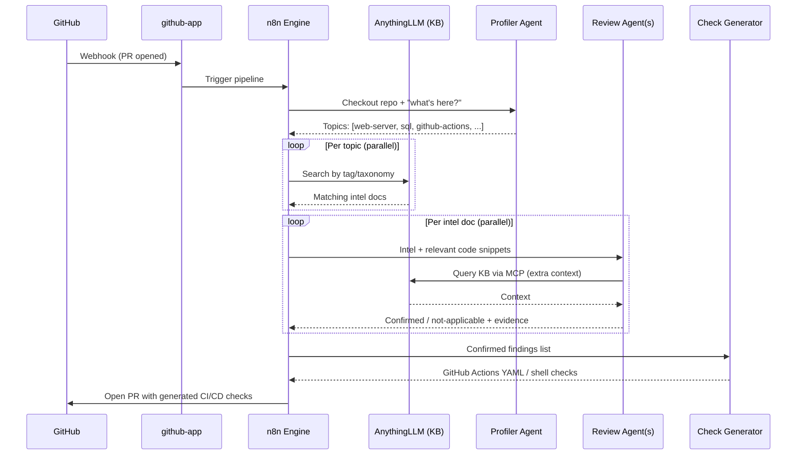
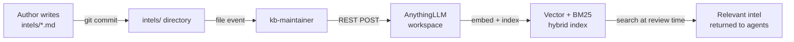

# ReviewBot — Architecture Overview

> **Status**: Draft · February 2026  
> **Goal**: Automatically analyse any GitHub repository for security vulnerabilities, generate lightweight CI checks, and open a Pull Request with those checks in the target repository.

---

## Vision

ReviewBot transforms from a simple webhook responder into a full **AI-powered security review pipeline**. When triggered (manually or on a new PR), the system:

1. Checks out the target repository locally.
2. Identifies relevant threat models from an internal **Knowledge Base**.
3. Spawns focused AI agents, each examining one class of vulnerability.
4. Generates CI/CD checks (GitHub Actions, etc.) for every confirmed finding.
5. Opens a Pull Request in the target repository with those checks.

Any subsequent commit to the repository runs only the **lightweight generated checks** — the expensive AI pipeline is only invoked again when a full re-review is requested.

---

## High-Level Components

```
┌────────────────────────────────────────────────────────────────────┐
│                          ReviewBot System                          │
│                                                                    │
│  ┌──────────────┐    ┌──────────────────┐    ┌──────────────────┐ │
│  │  GitHub App  │───▶│ Pipeline Engine  │───▶│   Knowledge Base │ │
│  │  (Webhook)   │    │  (n8n-based)     │◀───│   (Intel Store)  │ │
│  └──────────────┘    └────────┬─────────┘    └──────────────────┘ │
│                               │                                    │
│                    ┌──────────▼──────────┐                        │
│                    │   AI Agents Layer   │                        │
│                    │ (Gemini / Claude /  │                        │
│                    │  local LLM)         │                        │
│                    └──────────┬──────────┘                        │
│                               │                                    │
│                    ┌──────────▼──────────┐                        │
│                    │  Output: PR with    │                        │
│                    │  CI/CD Checks       │                        │
│                    └─────────────────────┘                        │
└────────────────────────────────────────────────────────────────────┘
```

### Services / Packages

| # | Name | Role | Tech |
|---|------|------|------|
| 1 | **github-app** | Receives GitHub webhooks, authenticates as GitHub App, opens PRs | Go (existing) |
| 2 | **knowledge-base** | Vector + semantic search over Intel documents | **AnythingLLM** (self-hosted) |
| 3 | **kb-maintainer** | Watches `./intels/*.md` and keeps AnythingLLM workspace in sync | Go service (`services/kb-maintainer`) |
| 4 | **pipeline-engine** | Orchestrates multi-step AI review workflow | n8n (self-hosted) |
| 5 | **agent-runner** | Thin wrapper to invoke Gemini / Claude / local model with a prompt and return structured output | Go or n8n node |

---

## Pipeline Execution Flow

```
[Trigger: PR opened / manual]
        │
        ▼
1. CHECKOUT — clone target repo to ephemeral workspace
        │
        ▼
2. PROFILING AGENT
   Prompt: "Analyse this code. What services, frameworks,
            languages and attack surfaces are present?"
   Output: list of topics (e.g. "web-server", "sql", "github-actions")
        │
        ▼
3. KNOWLEDGE BASE LOOKUP (parallel per topic)
   → Search by tag / taxonomy path
   → Return matching Intel documents
        │
        ▼
4. REVIEW AGENTS (parallel, one per Intel)
   Prompt: Intel document + relevant code snippets
   Output: "Vulnerability confirmed / not applicable + evidence"
        │
        ▼
5. CHECK GENERATOR AGENT
   Prompt: list of confirmed findings
   Output: GitHub Actions YAML / shell scripts implementing the checks
        │
        ▼
6. PR CREATION
   Commit generated checks to a new branch, open PR in target repo
```

---

## Repository Layout (Target)

```
reviewbot/
├── main.go
├── internal/
│   ├── config/
│   ├── github/          ← existing webhook + API client
│   ├── handler/         ← existing event handlers
│   ├── git/             ← existing git helpers
│   ├── middleware/
│   └── oauth/
│
├── pkg/                 ← NEW: independent, reusable packages
│   ├── knowledgebase/   ← KB client library (see docs/knowledgebase/)
│   └── pipeline/        ← pipeline primitive types & interfaces
│
├── services/            ← standalone microservices
│   └── kb-maintainer/   ← syncs ./intels → AnythingLLM workspace
│
├── n8n/                 ← NEW: n8n workflow definitions + custom nodes
│   └── nodes/
│
└── docs/
    ├── ARCHITECTURE.md  ← this file
    ├── knowledgebase/
    │   ├── REQUIREMENTS.md
    │   └── DESIGN.md
    └── pipeline/
        └── REQUIREMENTS.md
```

---

## Sub-documents

| Document | Description |
|----------|-------------|
| [knowledgebase/REQUIREMENTS.md](knowledgebase/REQUIREMENTS.md) | Original requirements for the Knowledge Base service (superseded by AnythingLLM) |
| [knowledgebase/DESIGN.md](knowledgebase/DESIGN.md) | Original data model & storage evaluation (superseded by AnythingLLM) |
| [kb-maintainer/DESIGN.md](kb-maintainer/DESIGN.md) | Design of the KB Maintainer sync service |
| [pipeline/REQUIREMENTS.md](pipeline/REQUIREMENTS.md) | Requirements for the Pipeline Engine and its n8n custom nodes |

---

## Key Design Principles

1. **Separation of concerns** — each package/service can be developed and tested independently.
2. **Cheap at runtime, expensive upfront** — the heavy AI pipeline runs once; generated checks run on every commit for free.
3. **Open taxonomy** — the Knowledge Base taxonomy is a living tree; new vulnerability classes can be added without code changes.
4. **LLM-agnostic** — agent invocation goes through a thin interface; Gemini, Claude, or a local model are all plug-in replacements.
5. **Explainability** — every generated check must cite the Intel document that triggered it (traceable).

---

## System Overview Diagram



---

## Pipeline Execution Sequence



---

## Key Architectural Decisions

| Decision | Choice | Rationale |
|----------|--------|-----------|
| **Knowledge Base** | AnythingLLM (self-hosted) | Avoids building RAG from scratch; REST API + web UI; per-repo workspaces prevent context bleed |
| **Pipeline Orchestration** | n8n | Visual, self-hosted, built-in error handling & retry; configurable without redeploy |
| **Agent Execution** | Containerized Claude / Gemini | Async callback keeps n8n lightweight; parallel execution; easy model swap |
| **KB Access from Agents** | `mcp-anythingllm` MCP server | Agents query KB natively as a tool — no custom API code per executor |
| **Intel Sync** | `kb-maintainer` Go service | File-watcher → AnythingLLM REST; drop/edit/delete a `.md` = instant index update |
| **Review Strategy** | Expensive AI once → lightweight CI forever | Generated checks run on every commit for free; AI re-invoked only on explicit re-review |
| **LLM Agnosticism** | Thin interface; Gemini / Claude / local | Any model plugs in without changing orchestration; container per model |

---

## Data Flow: Intel Lifecycle


